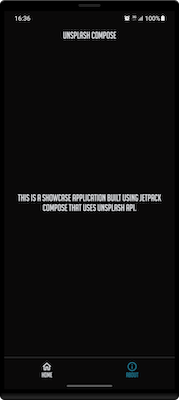

# A Composable New World!

This is the project created for the live demo of Jetpack Compose.

👉 [Presentation](https://speakerdeck.com/cmota/a-multiplatform-adventure)

There's another repository with Compose for Android, Desktop and Web along with Kotlin Multiplatform available here:

👉 [Source Code](https://github.com/cmota/kmm-a-multiplatform-adventure)

## Features

This application fetches a list of trending images from Unsplash API.

Additionally, it also allows to search images for any topic.

## Components

List of components used:
- Row, Column, LazyColumn, Image, Text, OutlinedTextField, Scaffold, Modifiers, Spacer
- NavHost

Additional libraries used:
- Coil
- Accompanist (swipe to refresh)

## Screens

<h3 align="center">
  
  
</h3>